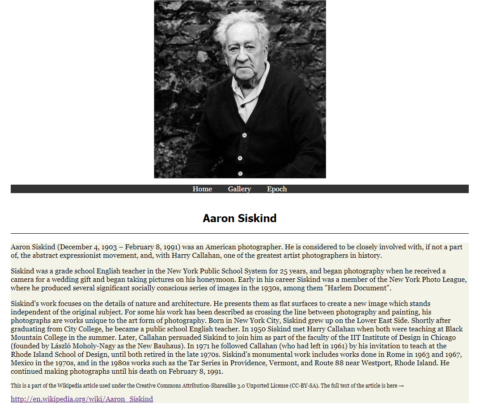

# 03 | CSS

## Aufgabe 1: CSS-Grundlagen Mozilla Developer Guides

Absolvieren Sie das Tutorial von _Mozilla Developer Guides_ unter https://developer.mozilla.org/en-US/docs/Learn/CSS/First_steps/Getting_started. Nutzen Sie den auf der Webseite integrierten interaktiven Editor, um die praktischen Übungen zu machen und die Grundlagen der Verwendung von CSS kennenzulernen.

## Aufgabe 2: Erstellen einer einfach HTML-Seite mit CSS

In dieser Aufgabe sollen Sie eine einfache HTML-Seite mit CSS erstellen, die aus drei HTML-Dokumenten besteht. Arbeiten Sie an Ihrer HTML-Seite aus Übungsblatt 2 weiter. Falls Sie Übungsblatt 2 noch nicht bearbeitet haben, dann können Sie das nun nachholen :) 

Integrieren Sie CSS in Ihre HTML-Dokumente, indem Sie eine externe CSS-Datei generieren und diese in den HTML-Dokumenten referenzieren. Entwickeln Sie Ihre Seite weiter, indem Sie:

- Ihre Seite zentrieren

- eine Navigationsleiste verwenden, die sich färbt, sobald Sie den Mauszeiger über das entsprechende Feld positionieren.

- Sie Ihren Text mit Hilfe von z.B. Schriftarten, Schriftgrößen und Zeilenabständen formatieren.

- Sie eine kleine Blidergalerie erstellen, in der drei Bilder untereinander dargestellt werden.

 Sie werden am Mittwoch in der Vorlesung die Grundlagen von CSS kennenlernen. Zusätzlich dazu, sollen Ihnen die nachfolgenden Tutorials dabei helfen, die Seite zu strukturieren und zu designen:

_Seitenstrukturierung_:

Strukturieren Sie die Seite gemäß den Empfehlungen[^1] .

_Navigationsleiste_:

Verwenden Sie eine Navigationsleiste, um die Navigation zwischen den HTML-Dokumenten zu steuern[^2].

_Fonts_:

Verwenden Sie andere Schriftarten, um Ihre Seite ansprechend zu gestalten[^3][^4].

_Intro_:

Hier finden Sie eine kleine Einführung in CSS[^6].

Sie können sich am folgenden Screenshot orientieren.

{ height=12cm }

------

*Abgabekriterien:*

Laden Sie Ihre Antworten bis spätestens 25.5.2020 (23:59 Uhr) als zip-komprimierten Ordner auf GRIPS hoch.  Benennen Sie die einzelnen Dateien pro Aufgabe sinnvoll und verwenden Sie geeignete Formate:

- Aufgabe 2: Das gesamte Projekt (HTML,CSS)

Der Name der Datei ergibt sich aus dem Präfix „Übung_WT_SS20“, der Nr. des Übungsblattes, ihrem Vor- und Nachnamen jeweils getrennt durch _ .

 

Beispiel: **Übung_WT_SS20_3_Max_Mustermann.zip**

[^1]: https://wiki.selfhtml.org/wiki/HTML/Tutorials/HTML5/Seitenstrukturierung
[^2]: https://www.w3schools.com/css/css_navbar.asp
[^3]: https://www.w3schools.com/css/css_font.asp
[^4]: https://www.w3schools.com/cssref/css_websafe_fonts.asp
[^6]: https://www.w3schools.com/css/css_intro.asp